# Территории развития этно-музыки в Российской Федерации

## Задачи исследования:

*  Сбор, структурирование и визуализация социальных (пол, возраст и проч.) и статистических (количество подписчиков) характеристик двух региональных этно-групп/объединений 

* Определить локальность (региональный или внерегиональный характер) деятельности анализируемых групп 

* Сравнить исследуемые группы. Определить существующие сетевые взаимодействия между представителями конкретных территорий

* Определить города-центры развития этно-музыки в РФ на основании двух пабликов (Жители каких городов являются участниками исследуемых пабликов)

* Визуализировать полученную информацию и предоставить выводы исследования"

В качестве предмета исследования нами были выбраны две ВК-группы: [Ored Recordings](https://vk.com/ored_recordings) и [ХУУН-ХУУР-ТУ](https://vk.com/huunhuurtu). Ored Recordings - крупнейший этно-музыкальный лейбл в России, издающий традиционную музыку Северного Кавказа. Лейбл активно сотрудничает с западными музыкальными объединениями, значительно способствует актуализации кавказской народной музыки на современных российских и международных экспериментальной и альтернативной сценах. Хуун-хуур-ту - музыкальный коллектив традицинной музыки Тувы. Группа активно выступает как в России, так и зарубежом (например, на радио [KEXP](https://www.youtube.com/watch?v=R2ovoRyv4kw)), в значительной степени способствуя популяризации тувинского музыкального фольклора во всем мире. Полагаем, что изучение и анализ ВК-групп именно этих двух музыкальных объединений, принадлежащих к абсолютно разным национально-этническим центрам РФ, позволит отразить территориальную специфику развития этно-музыки в России в целом. 

## Социальные и статистические характеристики ВК-группы Ored recordings.

На настоящий момент в группе состоит около 7300 человек. 

В гендерном отношении участники сообщества преимущественно мужчины: их количество более 4 тысяч, в то время как количество женщин, состоящих в группе Ored Recordings, не достигает и 3 тысяч. Вероятно, такая диспропорция объясняется национальным окрасом темаатического содержания группы, связанного с народной музыкой именно Северного Кавказа, и по сей день известного своим особым традиционализмом гендерных отношений. 

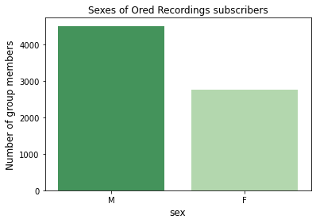

Большинство участников ВК-сообщества Ored Recordings принадледжат к так называемым "миллениалам" - поколению людей, родившихся с 1981 по 1996 год. Больше всего среди членов группы людей, родившихся в 1990-м и 1991-м годах. Также значительное их число родилось в 1987-м, 1989-м и с 1993-го по 1996-й годы. Кроме того, среди участников сообщества немало тех, кто родился в 1980-е. На основании этих данных можно предположить, что традиционная кавказская музыкальная эстетика в нашей стране преимущественно близка людям старше 25 и особенно старше 30 лет, что объясняется, вероятно, чувством социальной турбулетности и связанным с ним стремлением к компенсаторному "поиску корней", свойственным поколению 90-х. 

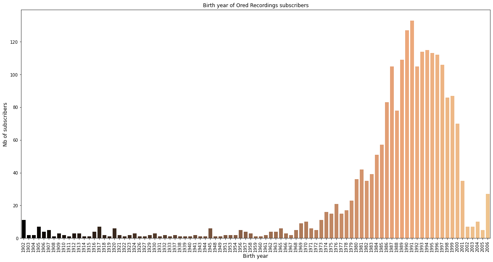

Что касается особенно важной в рамках нашего исследования территориальной привязки подписчиков ВК-сообщества Ored Recordings, то наибольшую долю среди них составляют жители крупнейших городов России: москвичи (около 1300 чел.) и петербуржцы (более 600 чел.). На третьем месте в общем количестве членов группы расположились подписчики из Нальчика (около 200 чел.), что неудивительно: Ored Recordings был создан черкесом по национальности [Булатом Халиловым](https://vk.com/ored_bulat) именно в этом городе - столице Кабардино-Балкарии. Также к 30 наиболее часто встречающимся городам, жителями которых являются подписчики группы Ored Recordings, принадлежат и другие крупные террриторииальные центры Северного Кавказа: Майкоп, Черкесск, Махачкала, Владикавказ, Ставрополь и Пятигорск. 

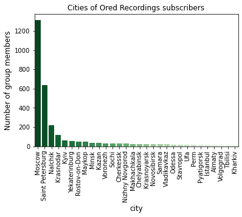

Тот факт, что чаще всего подписчиками Ored Recordings являются москвичи и петербуржцы не означает, однако, что традиционная кавказская музыка, выпускающаяся лейблом, популярна исключительно среди них. Более детальное исследование соотношения между жителями Москвы и Петербурга и жителями других городов среди участников исследуемого ВК-сообщества показывает, что доля москвичей и петербуржцев несколько ниже доли тех, кто не живет в этих двух крупнейих городах России. 

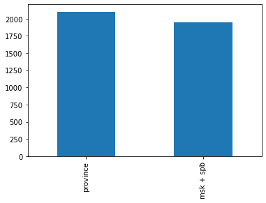 

Тем не менее, невозможно отрицать, что доля москвичей и петербуржцев превышает количество подписанных на ВК-сообщество Ored Recordings жителей любого другого отдельного города, что уже было продемонстрировано соответствующим графиком. Такая ситуация, вероятно, объясняется не только тем, что население Москвы и Петербурга в разы превышает население любого другого города как России, так и стран СНГ, но и тем, что жители Северного Кавказа чаще всего мигрируют именно в эти города, особенно в Москву: напомню, именно москвичей среди подписчиков ВК-группы Ored Recordings больше всего - около 1300 человек. Помимо всего прочего, нельзя не заметить, что в последние годы среди жителей крупных мегаполисов продолжает расти интерес к традиционной и этнической музыке, играющей для них компенсаторную функцию в условиях свойственной членам модерных обществ потери связи с собственными национальными корнями и непрерывно возрастающих темпов межнационального и межкультурного взаимодействия, наблюдаемого ими повседневно. 

## Социальные и статистические характеристики Вк-группы ХУУН-ХУУР-ТУ

На настоящий момент в группе состоит около 5500 человек. Весьма незначительное количество относительно других крупных музыкальных поп-объединений, но довольно ощутимое в отношении изначально малочисленного сегмента этно-музыки, который не может похвастаться внушительной аудиторией. Другими словами, в «узких кругах» «знающие люди» и любители про Хуун-Хуур-Ту знают и хорошо наслышаны. 

Гендерное соотношение подписчиков группы показывает значительный перевес мужской аудитории, превышающей женскую практически в 1,5 раза. В целом, это подтверждает общий интерес к этно-музыке со стороны мужского населения. 

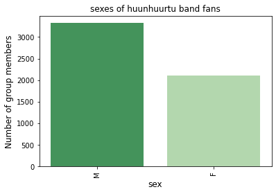

Аудитория группы представлена людьми молодого-среднего возраста (миллениалы, родившиеся в период 1980 — 1990-х гг.). Чрезвычайно высокий интерес со стороны людей 30-33 лет. Наиболее молодая аудитория (14 лет и, очевидно, меньше) также проявляет заметное внимание к деятельности группы. Таким образом, основная аудитория группы — люди, пережившие (на том или ином уровне восприятия) социальные потрясения 1990-х гг., отмеченные кризисом национального самосознания и деформацией многих социо-культурных предрассудков. Именно на 1990-е гг. и пришёлся «бум» этнической музыки. Распад СССР оказался одним из определяющих факторов, на пространстве которого и стали возникать многочисленные музыкальные этно-объединения. Хуун-Хуур-Ту — закономерная часть этой тенденции в логике возрождения тувинской песни и музыкального наследия. Её сегодняшние слушатели — аудитория, хорошо знакомая уже много лет с творчеством группы. 

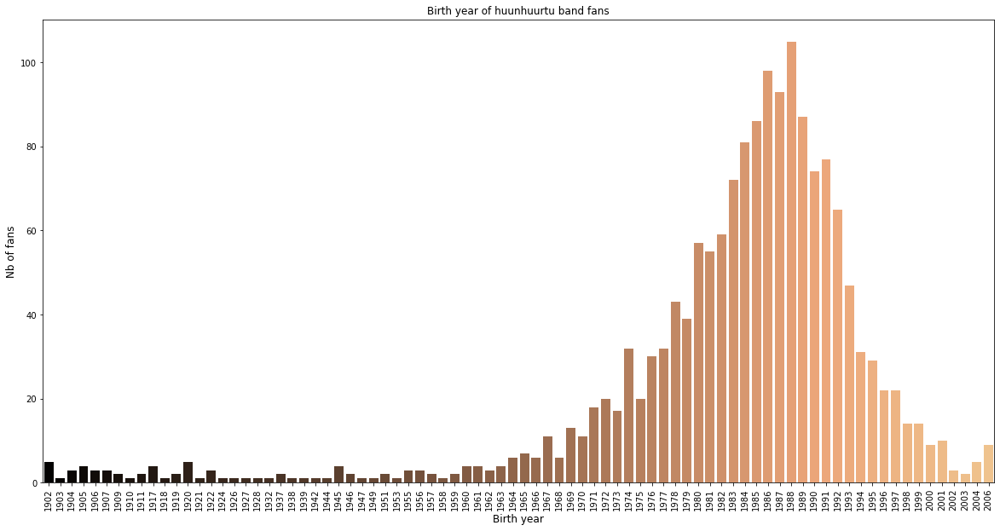

Из 5500 человек лишь 5-ая часть — это аудитория из Москвы и Санкт Петербурга (около 1100 человек), остальные — жители других региональных центров, расположенных преимущественно в восточной части России (Урал и Сибирь). Более детальный разбор соотношения между жителями Москвы и Петербурга и жителями других городов среди участников исследуемого ВК-сообщества довольно наглядно выявил, что доля москвичей и петербуржцев в целом заметно ниже (больше, чем в два раза) доли тех, кто не живет в этих двух крупнейих городах России. 

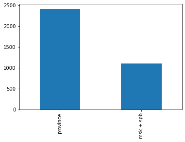

Примечательно, что относительно большое число подписчиков (200) проживает в Кызыле — региональном центре Тывы, который и представляет объединение «Хуун-Хуур-Ту» как в культурном, так и в этническом отношении. Стоит заключить, что аудитория группы довольно равномерно распределена по всем регионам России, показывая разумное и объяснимое превалирование регионального центра и наиболее крупных городов страны. 

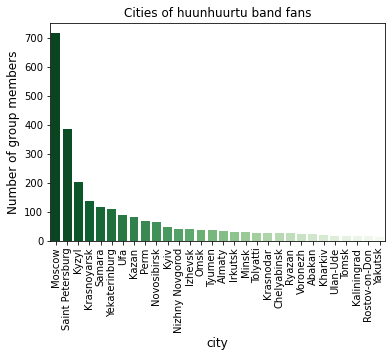

## Сравнение аудитории обеих групп, выявление сетевых взаимодействий между ними

### Подписчики обеих групп одновременно

Около 100 человек (124) являются одновременно подписчиками двух групп. Это свидетельствует об узкой специфике и ориентации изучаемых этно-объединений, которые изначально не рассчитаны на широкую и массовую аудиторию. Ещё один фактор — сильные отличия между конкретными группами: совершенно разные музыкальные традиции и инструментарий, предполагающий «своего» зрителя для каждого из подходов. Очевидно, что в основном подписчики этих групп не столько фанаты этно-музыки как жанра, сколько фанаты конкретных исполнителей и конкретного звучания: либо Ored Recordings, либо Хуун-Хуур-Ту. Практически никто не готов проявить интерес к двум группам одновременно. Тем не менее, стоит рассмотреть эту малочисленную аудиторию из этно-меломанов из 100 человек. 

Гендерное соотношение подписчиков одновременно двух групп показывает значительное преобладание мужской аудитории, превышающей женскую более, чем в два раза. В пропорциональном соотношении ещё больше мужчин готовы слушать обе эти группы одновременно. Со стороны женской аудитории интерес лишь ослабевает. 

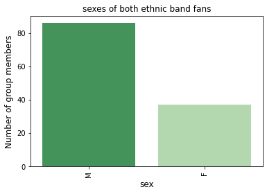

Аудитория, слушающая одновременно две указанные группы, оказывается даже чуть более возрастной, чем подписчики этих групп, рассмотренные по отдельности. Слушающие две группы одновременно — это преимущественно взрослые люди около 40 лет. Хотя по-прежнему очевиден интерес и со стороны молодой аудитории (в том числе — подростков). В любом случае, большая часть подписчиков — люди, чьё формирование пришлось на 1990-е годы, особенности которых были уже неоднократно озвучены. Именно это и объясняет их, действительно, редкий и специфический интерес к этно-музыке сейчас.

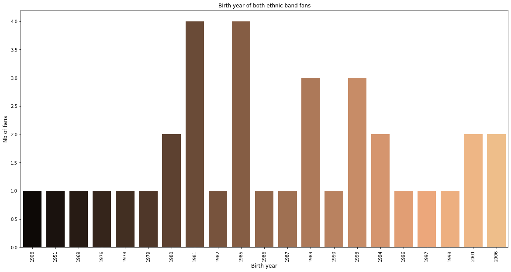

Примечательно, что территориальные характеристики оказываются сильно отличными от показателей двух групп по отдельности. Доля жителей Москвы и Санкт-Петербурга оказывается не просто весомой, как было раньше, но даже превышающей долю аудитории из других регионов вместе взятых. 

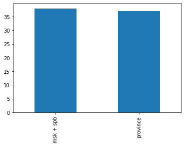

Среди других городов — традиционные региональные центры, расположенные как в западных (Краснодар, Элиста, Самара, Нижний Новгород, Ярославль, Мурманск и т.д.), так и в восточных регионах России (Пермь, Уфа, Красноярск, Омск, Новосибирск и др.). Таким образом, основная аудитория, интересующаяся деятельностью обеих групп, представлена жителями двух крупнейших городов России, которые одинаково далеко расположены как от центра тувинской музыки, так и от северо-кавказских музыкально-культурных региональных объединений. 

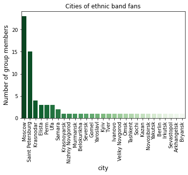

Всё это лишь подтверждает действительный рост интереса (хоть и малочисленный) к традиционной и этнической музыке именно среди жителей крупных мегаполисов в логике компенсаторной практики обществ модерна, члены которых переживают потерю связей с собственными национальными корнями в условиях непрерывно возрастающих темпов межнационального и межкультурного взаимодействия, наблюдаемого ими повседневно в рамках глобализации.

### Аудитория двух групп в сумме

Гендерное соотношение между всеми подписчиками двух исследуемых ВК-групп по-прежнему демонстрирует преобладание мужской аудитории, превышающей женскую в полтора раза — довольно ожидаемый показатель. Стоит отметить, что разрыв при этом не столь радикальный как в выборке слушателей двух групп одновременно (там наблюдалось 2х-кратное превышение мужской аудитории). Можно ещё увереннее заявить, что традиционный характер гендерных отношений национальных культур России (как кавказской, так и тувинской) и объясняет такую характерную диспропорцию. 

Cуммарная аудитория двух групп представлена людьми молодого-среднего возраста (миллениалы, родившиеся в период 1980 — 1990-х гг.). Чрезвычайно высокий интерес со стороны людей 30-33 лет. Больше всего среди членов группы тех, кто родился в 1990-м и 1991-м годах. Резко падает интерес к группам у людей моложе 23 лет. Середина 1990-х гг. воспринимается здесь как условный водораздел между наиболее широким и, очевидно, преданным кругом поклонников двух этно-объединений и теми, кому такая музыка менее интересна. Подростковая аудитория (14 лет и меньше) также проявляет заметное внимание к деятельности исследуемых сообществ. Если принять во внимание тот факт, что основная аудитория ВК — это миллениалы, но при этом люди старшего поколения (1970-е гг.) довольно заметным образом представлены в рассматриваемых пабликах — становится очевидно, что традиционная музыкальная эстетика национальных регионов (Тувы и Кавказа) в нашей стране преимущественно близка людям старше 25 и особенно старше 30 лет, что объясняется, вероятно, чувством социальной турбулетности и связанным с ним стремлением к компенсаторному "поиску корней", свойственным поколению 90-х, о котором было неоднократно сказано раннее.  

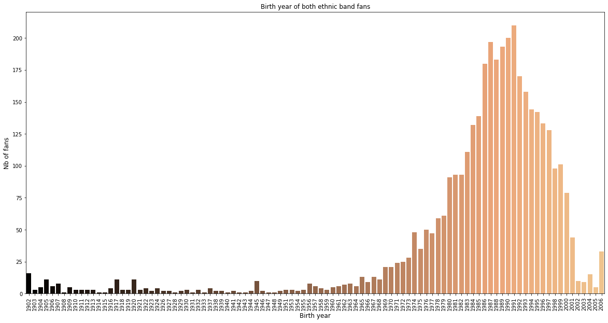

Комплексный территориальный анализ ожидаемым образом демонстрирует превалирующую долю жителей Москвы (2000 чел.) и Санкт-Петербурга (1000 чел.) среди подписчиков двух пабликов. Тем не менее, в пропорциональном соотношении эта доля оказывается ничтожно малой по сравнению с суммарной аудиторией подписчиков, проживающих в других регионах. "Региональный перевес" оказывается трёхкратным. 

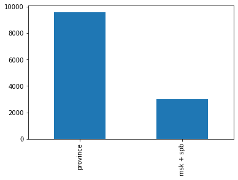

Эта децентрализация представляется ещё более любопытной, если обратить внимание, что значительная часть аудитории — жители Нальчика и Кызыла — культурно-национальных центров рассматриваемых музыкальных объединений. Среди других городов — традиционные региональные центры, расположенные как в западных (Краснодар, Самара, Казань, Нижний Новгород, Майкоп, Сочи и т.д.), так и в восточных регионах России (Екатеринбург, Пермь, Уфа, Красноярск, Омск, Новосибирск и др.). Таким образом, основная суммарная аудитория, интересующаяся деятельностью групп, довольно равномерно распределена по всем регионам России, показывая разумное и объяснимое превалирование региональных центров (Кызыл и Нальчик) и наиболее крупных городов страны. 

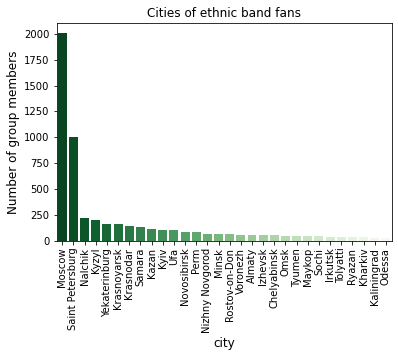

## Общие выводы

* Становится очевидно, что аудитории двух групп практически в равной степени оказываются децентрализованными, будучи рассредоточенными по всей России. Вполне объяснимая диспропорция в пользу Москвы и Санкт-Петербурга оказывается мало значимой. Однако стоит отметить неслучайное преобладание Кызыла и Нальчика — национальных столиц и культурно-этнических центров деятельности соответствующих ВК-групп, рассматриваемых в исследовании. Таким образом, интерес к этно-музыке довольно равномерно распределён по всей стране — он не замыкается в границах собственных региональных центров и не оказывается исключительной привилегией крупнейших мегаполисов России. 

* Аудитория этно-групп предстаёт весьма избирательной даже в отношении предпочитаемого им жанра. Те, кто слушает и следит за работой "Ored Recordings", не проявляют заметного интереса к творчеству "Хуун-Хуур-Ту" и наоборот. Объединение двух этих аудиторий в одной выборке оказывается в некотором смысле искусственным, аргументируясь в настоящем исследовании довольно формальным в этом случае критерием жанра. Его формальность и "искусственность" особенно очевидна, ведь в основном подписчики этих групп не столько фанаты просто этно-музыки как жанра, сколько фанаты конкретных исполнителей и конкретного звучания. Тем не менее, задачей исследования было определение именно степени взаимодействия в логике сравнения указанных групп. Очевидно, что степень этого взаимодействия оказывается минимальной. 

* Что касается городов-центров развития этно-музыки в Росии, то их список также очевдиным образом крайне децентрализован. В первую очередь речь идет о крупных городах, являющихся административными центрами различных регионов России (Москва, Санкт-Петербург, Краснодар, Пермь, Красноярск, Уфа и тд.). Кроме того, как это явственно следует из проведенного исследования, цетром развития северо-кавказского музыкального фольклора можно считать Нальчик - столицу Кабардино-Балкарии, а тувинской народной музыки - Кызыл, столицу Республики Тува. 

Для проведения комплексного исследования современной этно-сцены в России требует привлечения более широкиого массива данных, расширения исследовательских целей и методологии (проведение опросов, интервью и тд.). Тем не менее, поставленные нами задачи, связанные с определением территориальных центров развития этно-музыки в РФ посредствам парсинга двух указанных ВК-сообществ, мы считаем полностью выполненными. 

My yupiter notebook (коды по группе "Хуун-Хуур-Ту") is here [here](Huun.ipynb)

My yupiter notebook (коды по группе "Ored Recordings") is here [here](Ored_Recordings.ipynb)

My yupiter notebook (коды по двум группам вместе) is here [here](complex.ipynb)

