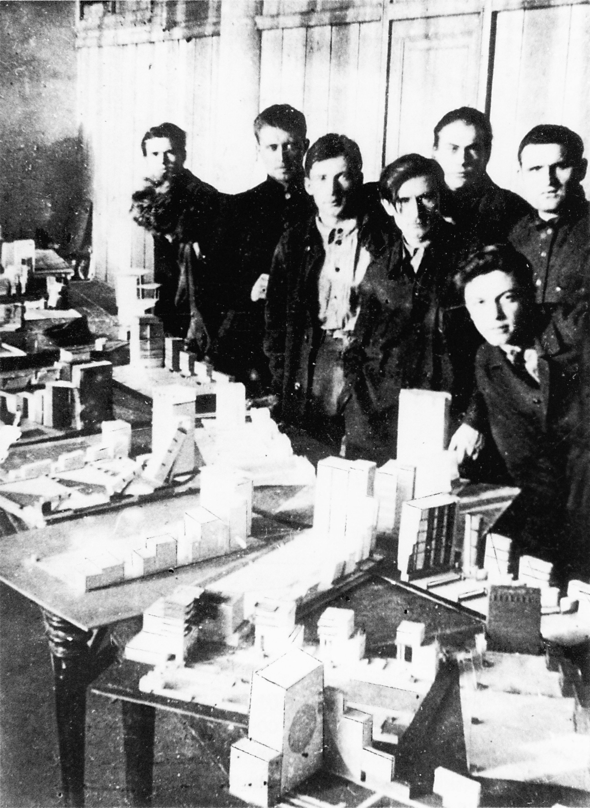

# Территории развития этно-музыки в Российской Федерации

## Задачи исследования:

*  Сбор, структурирование и визуализация социальных (пол, возраст и проч.) и статистических (количество подписчиков) характеристик двух региональных этно-групп/объединений 

* Определить локальность (региональный или внерегиональный характер) деятельности анализируемых групп 

* Сравнить исследуемые группы. Определить существующие сетевые взаимодействия между представителями конкретных территорий

* Определить города-центры развития этно-музыки в РФ на основании двух пабликов (Жители каких городов являются участниками исследуемых пабликов)

* Визуализировать полученную информацию и предоставить выводы исследования"

В качестве предмета исследования нами были выбраны две ВК-группы: [Ored Recordings](https://vk.com/ored_recordings) и [ХУУН-ХУУР-ТУ](https://vk.com/huunhuurtu). Ored Recordings - крупнейший этно-музыкальный лейбл в России, издающий традиционную музыку Северного Кавказа. Лейбл активно сотрудничает с западными музыкальными объединениями, значительно способствует актуализации кавказской народной музыки на современных российских и международных экспериментальной и альтернативной сценах. Хуун-хуур-ту - музыкальный коллектив традицинной музыки Тувы. Группа активно выступает как в России, так и зарубежом (например, на радио [KEXP](https://www.youtube.com/watch?v=R2ovoRyv4kw)), в значительной степени способствуя популяризации тувинского музыкального фольклора во всем мире. Полагаем, что изучение и анализ ВК-групп именно этих двух музыкальных объединений, принадлежащих к абсолютно разным национально-этническим центрам РФ, позволит отразить территориальную специфику развития этно-музыки в России в целом. 

## Социальные и статистические характеристики ВК-группы Ored recordings.

На настоящий момент в группе состоит около 7300 человек. 

В гендерном отношении участники сообщества преимущественно мужчины: их количество более 4 тысяч, в то время как количество женщин, состоящих в группе Ored Recordings, не достигает и 3 тысяч. Вероятно, такая диспропорция объясняется национальным окрасом тематического содержания группы, связанного с народной музыкой именно Северного Кавказа, и по сей день известного своим особым традиционализмом гендерных отношений. 

Большинство участников ВК-сообщества Ored Recordings принадледжат к так называемым "миллениалам" - поколению людей, родившихся с 1981 по 1996 год. Больше всего среди членов группы людей, родившихся в 1990-м и 1991-м годах. Также значительное их число родилось в 1987-м, 1989-м и с 1993-го по 1996-й годы. Кроме того, среди участников сообщества немало тех, кто родился в 1980-е. На основании этих данных можно предположить, что традиционная кавказская музыкальная эстетика в нашей стране преимущественно близка людям старше 25 и особенно старше 30 лет, что объясняется, вероятно, чувством социальной турбулетности и связанным с ним стремлением к компенсаторному "поиску корней", свойственным поколению 90-х. 

Что касается особенно важной в рамках нашего исследования территориальной привязки подписчиков ВК-сообщества Ored Recordings, то наибольшую долю среди них составляют жители крупнейших городов России: москвичи (более 1200 чел.) и петербуржцы (более 600 чел.). На третьем месте в общем количестве членов группы расположились подписчики из Нальчика (около 200 чел.), что неудивительно: Ored Recordings был создан черкесом по национальности [Булатом Халиловым](https://vk.com/ored_bulat) именно в этом городе - столице Кабардино-Балкарии. Также к 30 наиболее часто встречающимся городам, жителями которых являются подписчики группы Ored Recordings, принадлежат и другие крупные террриторииальные центры Северного Кавказа: Майкоп, Черкесск, Махачкала, Владикавказ, Ставрополь и Пятигорск. 

Тот факт, что чаще всего подписчиками Ored Recordings являются москвичи и петербуржцы не означает, однако, что традиционная кавказская музыка, выпускающаяся лейблом, популярна исключительно среди них. Более детальное исследование соотношения между жителями Москвы и Петербурга и жителями других городов среди участников исследуемого ВК-сообщества показывает, что доля москвичей и петербуржцев несколько ниже доли тех, кто не живет в этих двух крупнейих городах России. 

![image is here](img

## Социальные и статистические характеристики Вк-группы ХУУН-ХУУР-ТУ

## Сравнение аудитории обеих групп, выявление сетевых взаимодействий между ними

## Общие выводы

### subtitle

#### Smert' liberalam

##### Slava Putinu

**bold text**

__bold text__

*italic*

**_bolditalic_**

~~dddd~~

tupo text daffafasfdasfasfasfkkskdfksakfsdaks'flfkalskfksfk fdofkokkfokdkfl klkfkflkdafklkadak'dsfsfdsfk kfkk ksdfklks fkkds fkslfk klkflsk lkdlkf. fkfkdskfldkslklak kasklkasklfk klkaf klkalkflkdlfk kflkakfkalfkkfa;akfkdkaf'adfa flf'd kkdkfkfkkdfsk df'adfkads ff'lkflklkalk. kf'a'ffdaklfkkdkfk kfkd kadkfkkf. kafk'akfkakfdlkkfk kk k afdkfkasfkdfkdfkldkkkkakfkfdkdskfk afkskfdofrkfrg g gkkdskfg'fkafkofoora ' fkl kalkfaskfladkllll
* fdsafasfasffafadaf
* fadfsfdasfasfadsf
* fsdgdafadsfdsfadfaf

    - fgdfasdfdasf spisok 2 por'yadka
    
1. one 
2. two
3. three nado s tochkoy delat'

[vk API](https://vk.com/huunhuurtu)

 https://vk.com/huunhuurtu 
 
My yupiter notebook is here [here]()  
 
column1 | column2 | column3
:---- | ----: | :----:
text 1 | text 2 | text 3
text 4 | text 5 | text 6
